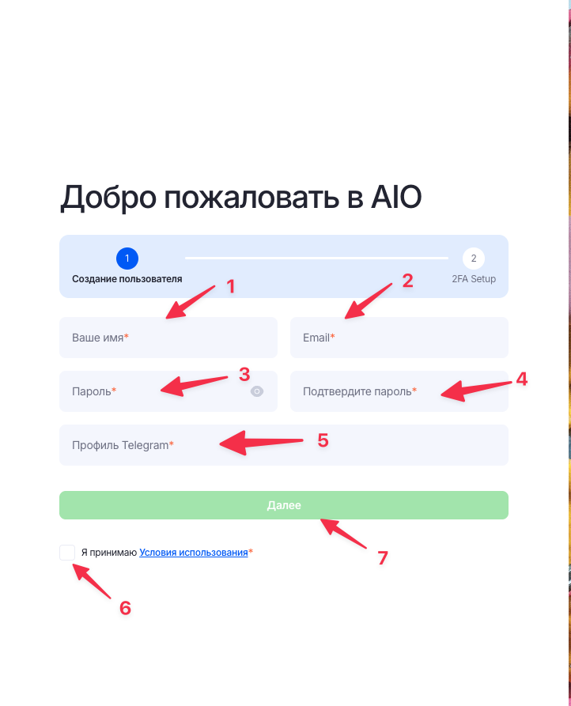
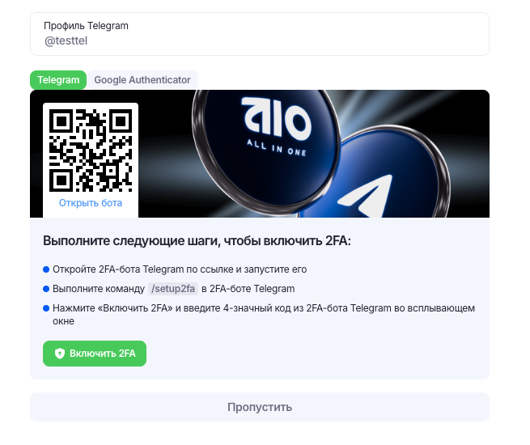
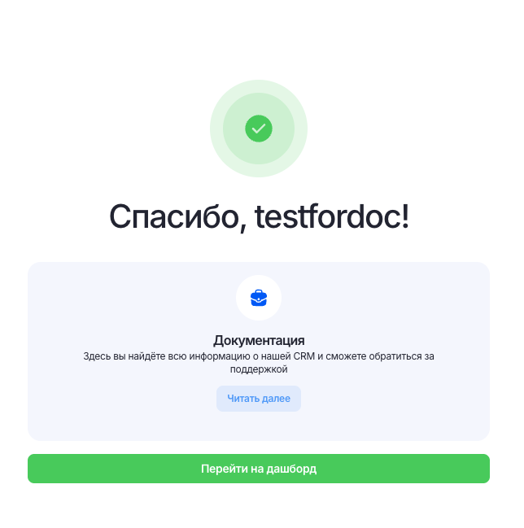

# Регистрация в AIO с помощью ссылки

После перехода по ссылке регистрации, появится форма для заполнения данных

Необходимо заполнить поля следуя правилам:

1. `Ваше имя` - ввести ник баера, *только буквы в нижнем регистре*
2. `Email` - рабочая почта
3. `Пароль`, `Подтверждение пароля` - пароль для входа, *должен содержать буквы в нижнем регистре, буквы в верхнеем регистре и спец.символы*
4. `Профиль телеграм` - сюда вставить только ник аккаунта, без значка `@`
5. `Принять соглашение` - ставим галочку
6. Кнопка `Далее` - нажимем, чтобы пройти дальше по регистрации

После нажатия кнопки `Далее`, произойдёт переход на страницу с предложением настроить двухфакторную аутентификацию

!!! info "Рекомендуется"
    Крайне рекомендуется настроить её сразу же, используя описанные пункты на странице, так как потом это даёт возможность просматривать большое кол-во важной информации, которая будет скрыта до ввода пароля, который будет приходить в телеграм.

Когда аутентификация настроена, произойдёт переход на финальную страницу регистрации, где будет ссылка на переход на Дашборд самого AIO. По ней жмём и всё, AIO в вашем распоряжении