# Как устроены кампании в AIO

## Переход в сам AIO

Для начала, необходимо перейти в сам AIO по [ссылке](https://app.aio.tech/app/dashboard)

 

## Как перейти на страницу кампаний

После перехода по ссылке, необходимо нажать на пункт меню `Tracker`, а затем в `Campaigns`

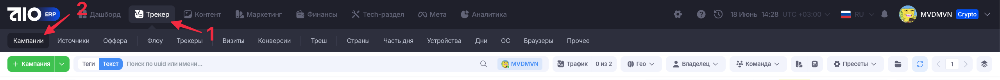

 

Так выглядит страница со всеми кампаниями, которые были созданы для баера

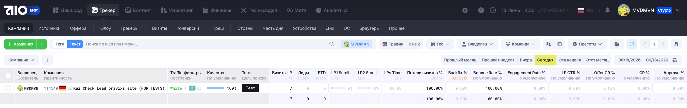

 

## Возможности фильтрации списка кампаний и изменения вывода статистики

Список кампаний можно фильтровать или делать поиск по нескольким ключевым параметрам:

1. Фильтр по `тегу источника`
2. Поиск по какому-то `ключевому слову`
3. Фильтр по `гео кампании`

Для фильтра по тегу команды, необходимо нажать на кнопку `Теги` и во всплывающем окне выбрать тег источника `GGL` или `FB`

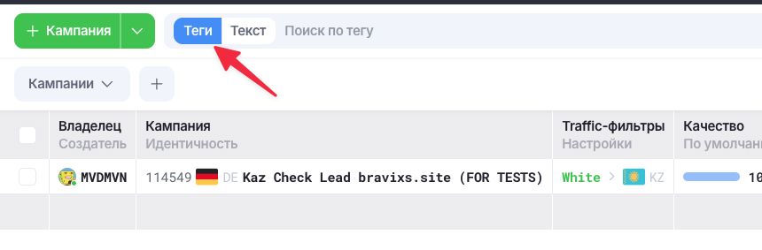

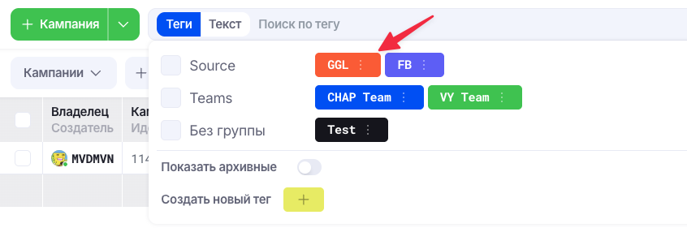

Для поиска по ключевому слову, необходимо выбрать пункт `Текст` и ввести нужное ключевое слово (домен, название оффера, либо какие-то свои доп. обозначения, которые можно добавить в название кампании) в поле ввода текста, а затем нажать `Enter`

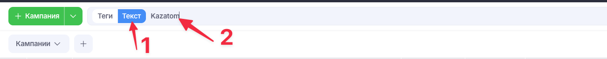

Для фильтра по гео кампании, необходимо нажать на кнопку `Гео`, ввести название страны, по которой хотим фильтровать, а затем выбрать эту страну

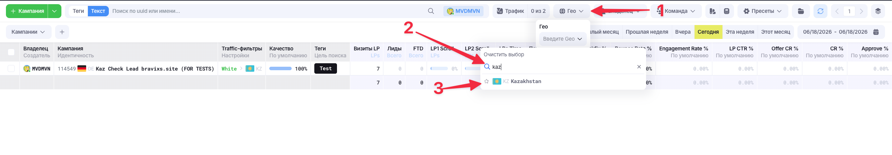

## Как зайти в саму кампанию

Для перехода в кампанию, необходимо в списке всех кампаний нажать на неё `Правой кнопкой мыши` и выбрать пункт `Редактировать кампанию`

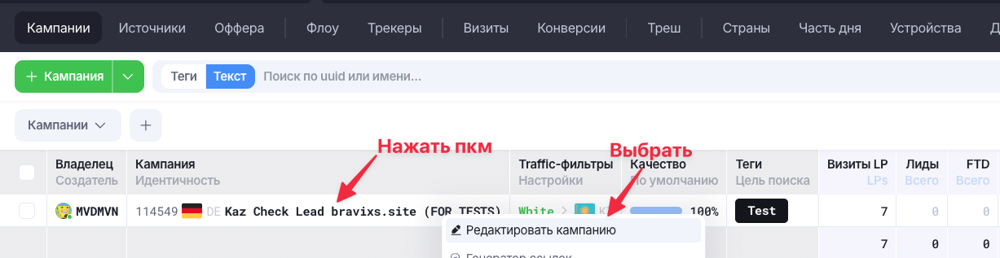

## Как устроено окно кампании

В левой панели указаны все детали кампании по типу названия, описания, страны, для которых сетап, все метки и т.д.

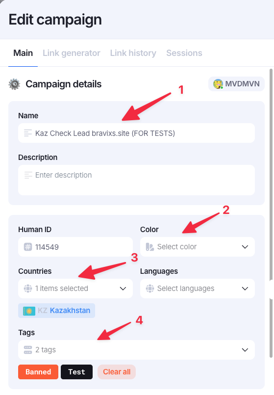

1. `Name` - название кампании. Его можно редактировать, добавляя нужную вам информацию.
2. `Color` - цвет, которым будет выделено название кампании в списке всех кампаний. Можно менять только на *красный*, когда домен отвалился и кампанию можно *удалять*.
3. `Countries` - страна, на которую будет идти траф. Выбор страны в этом поле позволяет фильтровать кампании по `гео`.
4. `Tags` - теги позволяют фильтровать кампании по нужным параметрам. Когда отдел разработки отдаёт кампанию, то у неё будет лишь 1 тег - тег команды.

!!! warning "Что необходимо делать, когда домен забанен" 
    В таком случае необходимо поменять цвет во втором пункте на *красный* и назначить дополнительный тег `Banned`.
    Сервер на котором все домены имеют такие параметры не будет продлеваться.

!!! warning "Как "удалять кампании""
    В AIO нет понятия "удалить" кампанию, они все кидаются в архив. Баера сами должны архивировать кампанию тогда, когда она вообще ему не нужна, *вообще*. 

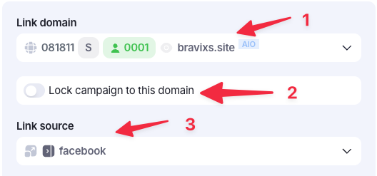

1. `Link domain` - тут указан домен кампании. Его менять нельзя.
2. Возможность закрепить домен за этой кампанией и при генерации ссылки через расширенное меню, домен будет недоступен.
3. `Link source` - тут выбирается источник, куда будет идти траф и какие поля для заполнения отобразить ниже.

## Как заполнять поля с метками (Google, FB)

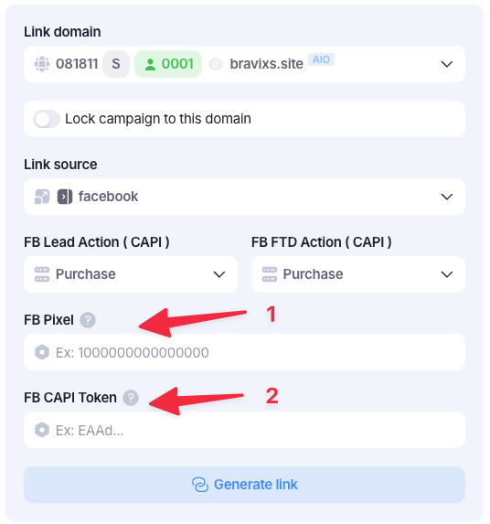

1. `FB Pixel` - пиксель, который берётся в кабинете FB и используется как для META, так и для API, заполняется в любом случае
2. `FB CAPI Token` - это токен, который берётся в API пикселя и заполняется только в том случае, если залив идёт на API 
 
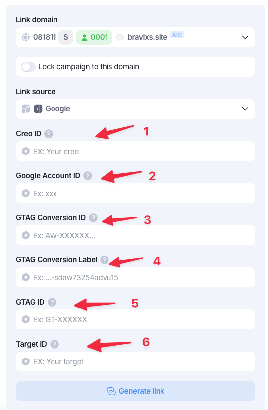

1. `Creo ID` - название крео
2. `Google Account ID` - это ID аккаунта google
3. `GTAG Conversion ID` - первая часть пикселя google, который начинается на AW-...... и всё до знака `/`
4. `GTAG Conversion Label` - вторая часть пикселя, которая после знака `/`
5. `GTAG ID` - вставлять тот же `GTAG Conversion ID`
6. `Target ID` - название таргета

В правой панели указан `Flow` кампании с настройками клоаки, вайта и оффера

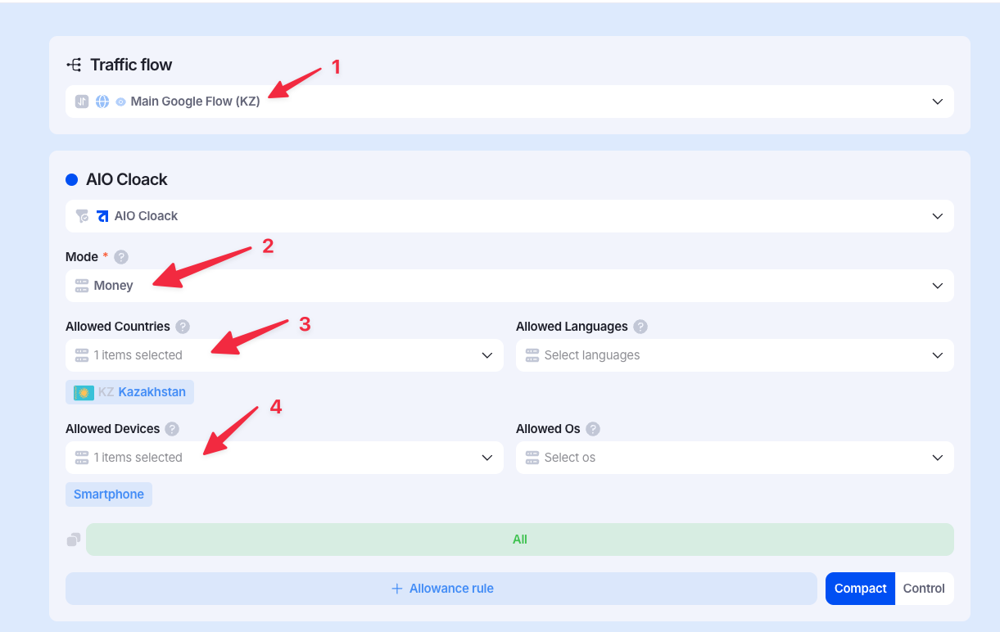

1. `Traffic flow` - `Flow` кампании, отвечает за то, как будет настроена клоака и настройки вайта/оффера. Это поле менять нельзя!
2. `Mode` - это тип клоаки, который сейчас выставлен
    1. `Filter` - это стандартный режим клоаки для залива. Целевая аудитория идёт на `Black`, нецелевая аудитория идёт на `White`.
    2. `Money` - клоака работает только на `Black`, весь траф идёт только на него.
    2. `White` - клоака работает только на `White`, весь траф идёт только на него.
3. `Allowed Countries` - страны, которые пропускает клоака на `Black`.
4. `Allowed Devices` - устройства, которые пропускает клоака на `Black`.

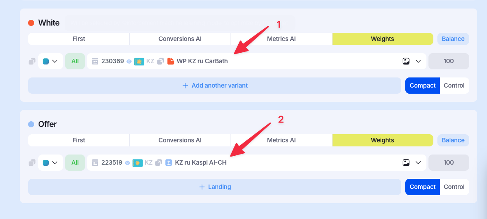

1. `White` - тут указывается какой ленд был выбран для нецелевой аудитории
2. `Black` - тут указывается какой оффер был выбран для целевой аудитории

!!! warning "Важно!"
    ❗️Настройки `Flow` в правой части окна кампании трогать ЗАПРЕЩЕНО❗️
