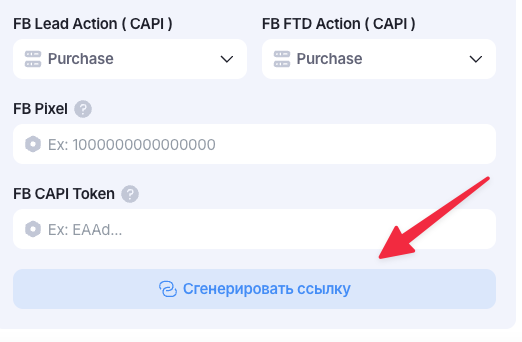
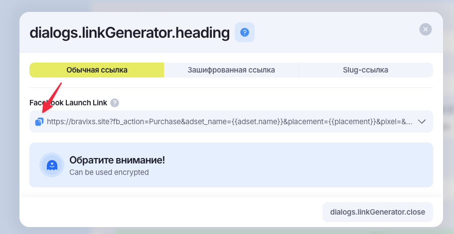

# Как сгенерировать ссылку для залива

!!! warning "Важно!"
    Ссылку нужно генерировать только после того, как все поля в самой кампании были заполнены. То есть, поля `FB Pixel`, `FB CAPI Token` или же `Google Account ID`, `Google Conversion ID`, `Google Conversion Label` и т.д. 
    Если не заполнить поля, сгенерировать ссылку, а потом заполнить поля, то *обязательно перегенерировать ссылку*, в первом варианте не будут подставлены данные из полей, которые были заполнены.

### Как сгенерировать ссылку
Чтобы сгенерировать ссылку, необходимо нажать кнопку `Сгенерировать ссылку`

### Как скопировать готовую ссылку

Откроется модальное окно, в котором можно будет увидеть сгенерированную ссылку с подставленными в неё метками, которые были указаны в кампании. 

Необходимо нажать на иконку копирования ссылки, после чего она скопируется в буфер обмена и с ней можно проводить все остальные манипуляции.

!!! info "Аккуратно"
    Стоит аккуратно генерировать ссылки, так как все сгенерированные ссылки "рабочие" и если была допущена ошибка в первой генерации, скопирована, использована, после чего сгенерирована новая, то нужно скопировать эту новую ссылку и использовать только её, так как предыдущая всё ещё рабочая и это может ввести в заблуждение.